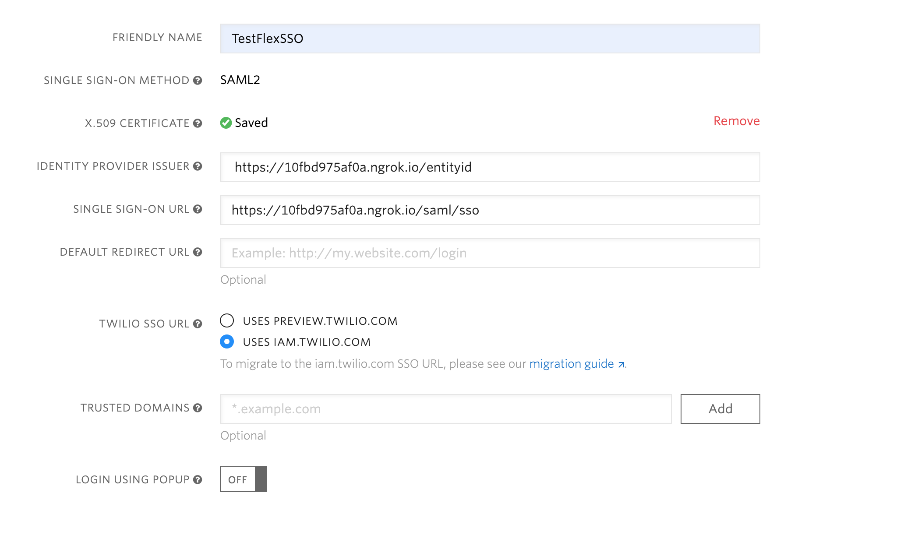
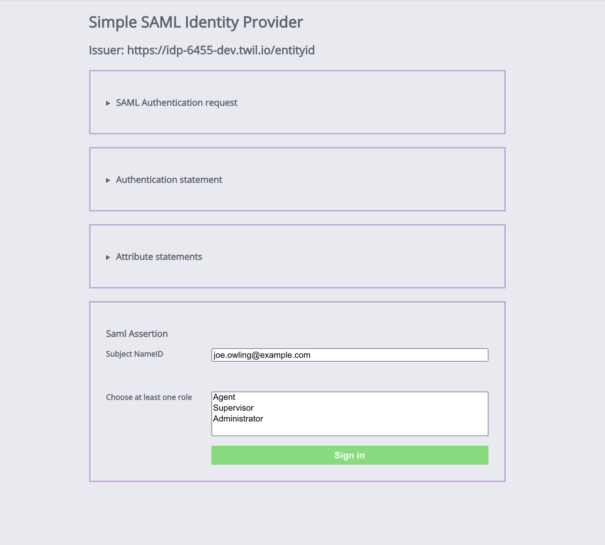
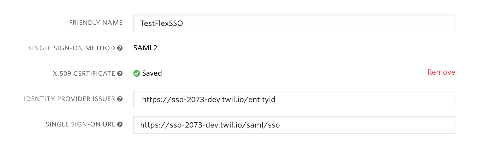

# Stub IdP functions for fake SSO


### What is this thing?
This repo is a pair of functions that shamelessly rip off a load of code from [this stub saml idp here](https://github.com/mcguinness/saml-idp)

#### Functions/Endpoints

These functions fake a SAML 2.0 sign in with HTTP POST bindings.

There are 3 end points / functions of interest in the repo:

1. sso.js on path /saml/sso which just takes a signed SAML SSO request and renders a form that displays some of the information about the request and a contains a hard coded username that will be singed in when the form is submitted

1. sign-in.js on path /saml/sign-in which is the fake sign in process. It does not check the user against any state in the fake idp system (there is no state). Rather it just creates a valid signed SAML response and renders that response back in a self submitting form (i.e. the HTTP POST binding) to the requesting service.

1. cert.js on path /cert which renders the public cert that clients will need for their SSO configuration.

There other js files in the functions directory are config and utility code.


#### Prerequisites

Node packages:

    - fast-xml-parser
    - hbs
    - saml
    - xml-crypto
    - zlib

For local development ngrok will also be needed.

For Twilio CLI deployment you will need the [CLI](https://www.twilio.com/docs/twilio-cli/quickstart) and [serverless plugin](https://github.com/twilio-labs/plugin-serverless).


## How to run locally

### Install dependencies

In the root of this repo run:

```
npm install
```

### Generate a key pair

```
openssl req -x509 -new -newkey rsa:2048 -nodes -subj '/C=US/ST=California/L=San Francisco/O=Twilip/CN=Test  Identity Provider' -keyout idp-private-key.private.pem -out idp-public-cert.private.pem
```

Note keep the key file names as they are in the sample openssl command above as those filenames are what the function is expecting.


### Run ngrok

```
ngrok http 3000
```

### Environment variables - For local development only

Copy .env.sample to .env for local development.

Set the ISSUER in .env to the https forwarding domain that ngrok prints to the console on startup.

```
ISSUER=https://[the-https-ngrok-domain].ngrok.io/entityid
```

### Configure Flex for SSO

First copy your public certifcate that you generated earlier (idp-private-key.private.pem).

Head over to the [Flex SSO configuration](https://www.twilio.com/console/flex/single-sign-on) for your Flex project.

1. Fill in the SSO config a 'FRIENDLY NAME' with a name of your choice
1. Paste the certificate into the input labelled 'X.509 CERTIFICATE'
1. Set the 'IDENTITY PROVIDER ISSUER' to the value of the ISSUER environment variable (as in you .env file)
1. Set the 'SINGLE SIGN-ON URL' to https://[the-https-ngrok-domain].ngrok.io/saml/sso

Leave the rest of the form as is. You won't need any of those for this example IdP.

Your form will look something like this:



### Start the functions locally

Back on your machine in the root of this repository, start up the functions locally:

```
twilio serverless:start
```

_***If you are already logged into Flex proper, then before testing the SSO login, make user you are logged out of Flex first***_

Then head back over to the [Flex SSO page](https://www.twilio.com/console/flex/single-sign-on) and you'll see a link entitle 'Login with SSO'. Click on the link and you'll be presented with the login page from this repo. See below.



It's a hard coded form with some metadata that is surfaced for your edification and pleasure. It's a fake login for Joe Owling, just used as an illustrative example.

To be more accurate it's a sort of mock up of a login form with one very important distinction that is totally unrealistic but serves to illustrate that an identity provider can update a users roles. To do that an html select input has been added to allow the user to select one or more roles that will be used for newly provisioned user roles, or updating an existing user's roles. In this case Joe Owling's roles.

If you click on the sign in button on the form, login will be processed and you should be then logged in and eventually land back in Flex in a logged in state (as Joe Owling).

If all is well and good you can deploy the functions using the Twilio CLI.


## Deploy the functions to Twilio

We can also deploy the functions to Twilio.

This is useful if we want to use this mock IdP for labs etc. so that participants can use this for SSO.

_***Note if deploying using the Twilio CLI rather than manually via the console, then the .env file would be used to create environment variables for the functions. However we don't need to use an environment variable for deployed functions. They can access the DOMAIN_NAME from the context object at runtime.***_

By default, functions (and their env vars) are not editable via Twilio web console.

So we'll need to do a bit of jiggery pokery for our .env file if deploying from our own machines.

Therefore:

 1. Move the .env file to .env.dev
 2. Deploy without the plugin
 3. If you want to carry on local development move the .env.dev back to .dev


### Deploy with Twilio CLI serverless plugin

In root of project enter:

```
twilio serverless:deploy
```

### Update Flex SSO to use deployed function

Now we can update the SSO configuration for you Flex project to use the deployed version of the function.

_***If you logged in earlier using a locally running function make sure you logout of Flex before testing against the deployed function.***_

Go to the [Flex SSO page](https://www.twilio.com/console/flex/single-sign-on) and update the
'IDENTITY PROVIDER ISSUER' and 'SINGLE SIGN-ON URL' fields in the form to use the domain for the deployed function. See screenshot below for an example:



Note that the cerficate generated earlier was uploaded as a private asset by the CLI serverless deploy command, therefore there's no need to update that in your Flex SSO configuration.

## Using as a shared IdP for labs

Once you have deployed these functions anyone can setup their Flex instances to use the deployed functions as their fake IdP.

The steps needed are:

1. Copy the public certificate from https://[function-domain].twil.io/cert
2. Go to [Flex SSO configuration](https://www.twilio.com/console/flex/single-sign-on)
3. Paste the cerficate from 1
4. Enter https://[function-domain].twil.io/entityid as IDENTITY PROVIDER ISSUER
5. Enter https://[function-domain].twil.io/saml/sso as SINGLE SIGN-ON URL

Then they can click sign in button to be logged in as Joe Owling.